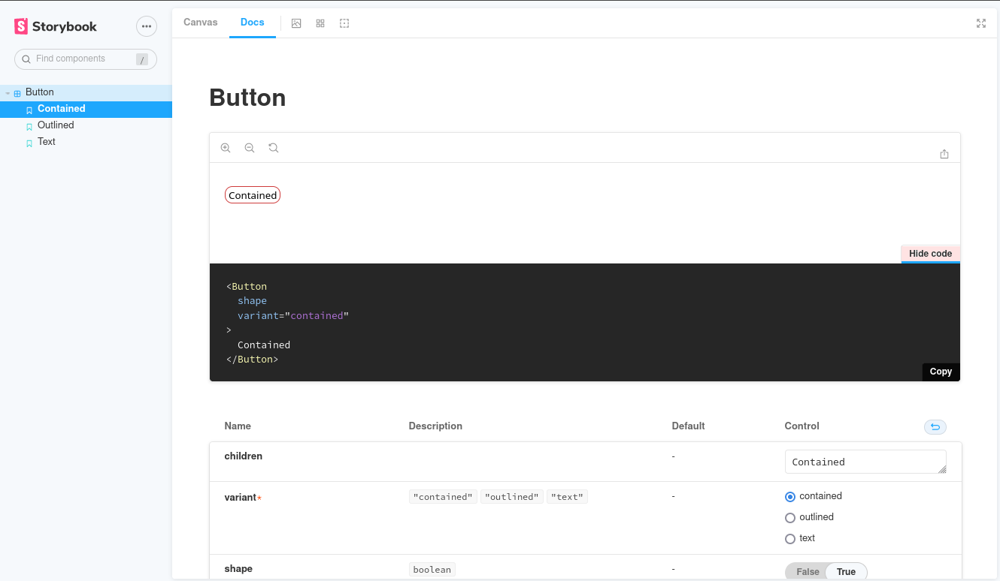

<a href="https://ocade-compagny.github.io/ocade-composants/" title="Click pour voir la documentation">
  <p align="center">
    
  </p>
</a>

# Ocade Composants

[](https://ocade-compagny.github.io/ocade-composants/)


## Ocade Composants, c'est quoi ?
[Ocade Composants](https://github.com/ocade-compagny/ocade-composants) est une bibliothèque de composants React. Elle est destinée à être utilisée dans les applications développées par [Ocade Compagny](https://github.com/ocade-compagny/create-ocade-system) mais peut être utilisée dans n'importe qu'elle project utilisant React.


## Installation 
Vous pouvez installer cette bibliothèque via npm ou yarn.

```bash
npm install @ocade-compagny/ocade-composants
```

## Utilisation
L'utilisation de cette bibliothèque de composants est très simple. Il suffit d'importer le composant que vous souhaitez utiliser dans votre projet.

```javascript
import { Button } from '@ocade-compagny/ocade-composants';

const App = () => {
  return (
    <Button>Mon bouton</Button>
  );
}
```

## Comment connaître les composants disponibles ?
[](https://ocade-compagny.github.io/ocade-composants/) <br/>
Cliquez sur le lien ci-dessus et vous arrivez sur la documentation de cette bibliothèque de composants. Vous y trouverez la liste des composants disponibles et leur utilisation.



## Développement 
Si vous souhaitez contribuer à cette bibliothèque de composants, vous pouvez cloner le projet dans votre dossier de travail.

1. Installer la bibliothèque @ocade-compagny/ocade-composants dans votre application
```bash
npm install @ocade-compagny/ocade-composants
```

2. Cloner le dépôt @ocade-composants dans votre dossier de travail
* Avec SSH:
```bash
git clone git@github.com:ocade-compagny/ocade-composants.git
```

* Avec HTTPS:
```bash
git clone https://github.com/ocade-compagny/ocade-composants.git
```

3. Faire pointer le package @ocade-compagny/ocade-composants vers le dossier du dépôt cloné. Dans le fichier package.json de votre application, modifier la ligne suivante:
```json
"dependencies": {
  ...,
  "@ocade-compagny/ocade-composants": "x.x.x",
  ...,
}
```
par
```json
"dependencies": {
  ...,
  "@ocade-compagny/ocade-composants": "file:ocade-composants",
  ...,
}
```
où `ocade-composants` est le dossier du dépôt cloné.

2. Installer les dépendances de la bibliothèque @ocade-compagny/ocade-composants
```bash
cd ocade-composants && npm install
```

Concraitement, vous pouvez maintenant développer dans le dossier cloné et lorsque vous voulez voir vos résultats dans votre application React, vous avez simplement à build la librairie avec la commande 
```
npm run build
```

### [Nodemon](https://www.npmjs.com/package/nodemon) pour vous aider
Si vous souhaitez developper sans avoir à relancer la commande `npm run dev` a chaque fois, vous pouvez lancer le serveur nodemon qui surveillera les changements pour vous
```
npm run dev
```

### Vous êtes contributeur ?
Dans le cas où vous êtes un contributeur du projet, lorsque vous avez fini de développer, vous pouvez faire une pull request sur la branche `develop` du projet.

## Switcher entre bibliothèque publiée et bibliothèque en développement ?

Il faut aller dans le fichier package.json et au niveau de `@ocade-compagny/ocade-composants` changer la version par `file:../ocade-composants` pour pointer vers le dossier de développement et `x.x.x` pour pointer vers la version publiée.


## Feuille de styles des composants
Le système de feuille de style enter Storybook et un projet React. 
Tout les feuilles de styles sont centralisées dans le dossier src de la libraire. 

### Storybook
Storybook est paramétré pour récupérer directement les style et les appliquer. On peut voir le rendu en dev avec la commande `npm run storybook`.

### React
Dans un projet React, si on veut bénéficier du style par défault des composants, il faut ajouter dans le fichier `App.js` la ligne suivante:
```javascript
import "@ocade-compagny/ocade-composants/dist/index.css";
```
C'est ainsi qu'on récupère la feuille de style de la librairie dans un projet React. On peut surcharger le style en imbriquant les classes CSS. (Tips) Lors de l'imbrication, commencer par `.App` ce qui aura pour effet pour le même selecteur que dans la libraiire, de surcharger le style de la librairie.