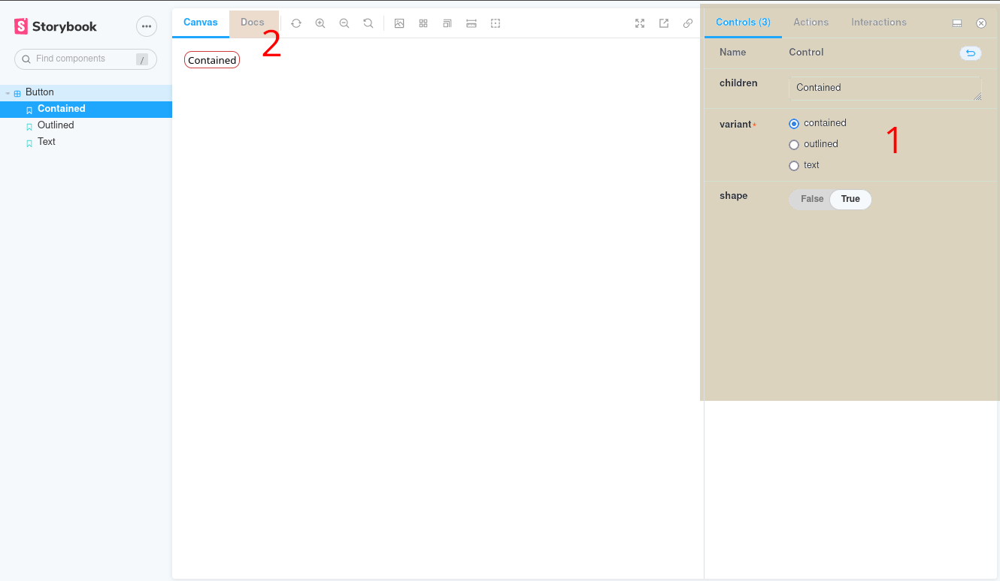

<a href="https://ocade-compagny.github.io/ocade-composants/" title="Click pour voir la documentation">
  <p align="center">
    
  </p>
</a>

# Ocade Composants

[](https://ocade-compagny.github.io/ocade-composants/)


## Ocade Composants, c'est quoi ?
[Ocade Composants](https://github.com/ocade-compagny/ocade-composants) est une bibliothèque de composants React. Elle est destinée à être utilisée dans les applications développées par [Ocade Compagny](https://github.com/ocade-compagny/create-ocade-system) mais peut être utilisée dans n'importe qu'elle project utilisant React.


## Installation 
Vous pouvez installer cette bibliothèque via npm ou yarn.

```bash
npm install @ocade-compagny/ocade-composants
```

* Ou via yarn
```bash
yarn add @ocade-compagny/ocade-composants
```


## Utilisation
L'utilisation de cette bibliothèque de composants est très simple. Il suffit d'importer le composant que vous souhaitez utiliser dans votre projet.

```javascript
import { Button } from '@ocade-compagny/ocade-composants';

const App = () => {
  return (
    <Button>Mon bouton</Button>
  );
}
```

## Comment connaître les composants disponibles ?
[](https://ocade-compagny.github.io/ocade-composants/)
Cliquez sur le lien ci-dessus et vous arrivez sur la documentation de cette bibliothèque de composants. Vous y trouverez la liste des composants disponibles et leur utilisation.



## Développement 
Si vous souhaitez contribuer à cette bibliothèque de composants, vous pouvez cloner le projet dans votre dossier de travail.

1. Installer la bibliothèque @ocade-compagny/ocade-composants dans votre application
```bash
npm install @ocade-compagny/ocade-composants
```

2. Cloner le dépôt @ocade-composants dans votre dossier de travail
* Avec SSH:
```bash
git clone git@github.com:ocade-compagny/ocade-composants.git
```

* Avec HTTPS:
```bash
git clone https://github.com/ocade-compagny/ocade-composants.git
```

3. Faire pointer le package @ocade-compagny/ocade-composants vers le dossier du dépôt cloné. Dans le fichier package.json de votre application, modifier la ligne suivante:
```json
"dependencies": {
  ...,
  "@ocade-compagny/ocade-composants": "x.x.x",
  ...,
}
```
par
```json
"dependencies": {
  ...,
  "@ocade-compagny/ocade-composants": "file:ocade-composants",
  ...,
}
```
où `ocade-composants` est le dossier du dépôt cloné.

2. Installer les dépendances de la bibliothèque @ocade-compagny/ocade-composants
```bash
cd ocade-composants && npm install
```

Concraitement, vous pouvez maintenant développer dans le dossier cloné et lorsque vous voulez voir vos résultats dans votre application React, vous avez simplement à build la librairie avec la commande 
```
npm run build
```

### [Nodemon](https://www.npmjs.com/package/nodemon) pour vous aider
Si vous souhaitez developper sans avoir à relancer la commande `npm run build` a chaque fois, vous pouvez lancer le serveur nodemon qui surveillera les changements pour vous
```
npm run dev
```

### Vous êtes contributeur ?
Dans le cas où vous êtes un contributeur du projet, lorsque vous avez fini de développer, vous pouvez faire une pull request sur la branche `develop` du projet.

## Switcher entre bibliothèque publiée et bibliothèque en développement ?

De bibliothèque publiée à dev:
```
npm unstall --save-dev @ocade-compagny/ocade-composants
npm install --save-dev file:ocade-composants
```

De dev à bibliothèque publiée:
```
npm unstall --save-dev file:ocade-composants
npm install --save-dev @ocade-compagny/ocade-composants
```

# Structure de la bibliothèque
La bibliothèque est composée de plusieurs dossiers et fichiers. Voici la structure de la bibliothèque.

```
ocade-composants
├── .github  # Fichiers de configuration pour github, contient des workflows pour publier la documentation sur github pages et incrémentter la version du package.
├── .husky   # Fichiers de configuration pour husky, permet de lancer des scripts avant de faire un commit ou un push.
├── .storybook  # Fichiers de configuration pour storybook (documentation de composants).
├── .vscode  # Fichiers de configuration pour vscode
├── coverage  # Résultats de la couverture de code (test unitaires)
├── dist # Fichiers de la bibliothèque compilée (c'est le dossier servit par npm)
├── node_modules  # Dossier des dépendances de la bibliothèque
├── readme # Images pour le readme
├── src # Dossier des sources de la bibliothèque
│   ├── components # Dossier des composants
│   │   ├── Button # Dossier du composant Button
│   │   │   ├── Button.tsx  # Fichier du composant Button
│   │   │   ├── Button.test.tsx # Fichier de test unitaire du composant Button
│   │   ├── index.ts  # Fichier d'export du composant Button et les autres composants du dossier
│   ├── index.ts  # Fichier d'export des composants général
│   ├── scss # Dossier des styles
│   │   ├── main.scss # Fichier des variables de styles et import des styles des composants
│   │   ├── Button.scss # Fichier des styles du composant Button
│   ├── stories # Dossier des stories de storybook
│   │   ├── Button.stories.tsx # Fichier des stories du composant Button
├── storybook-static # Fichiers de la documentation de storybook
├── .eslintrc.json # Fichier de configuration pour eslint
├── .gitignore # Fichier de configuration pour git
├── .stylintrc.json # Fichier de configuration pour stylelint
├── babel.config.js # Fichier de configuration pour babel
├── jest.config.js # Fichier de configuration pour jest
├── package.json # Fichier de configuration pour npm
├── package-lock.json # Fichier de configuration pour npm
├── README.md # Fichier de documentation du projet
├── rollup.config.js # Fichier de configuration pour rollup (compile la bibliothèque)
├── .tsconfig.json # Fichier de configuration pour typescript
```

# Package.json
A titre d'information, voici le package.json de la bibliothèque de composants.
## Exemple d'un package.json
```json
{
  "name": "@ocade-compagny/ocade-composants",
  "version": "1.0.64",
  "description": "Banque de composants by Ocade Compagny",
  "main": "dist/index.js",
  "module": "dist/index.es.js",
  "prepare": "npx husky install",
  "scripts": {
    "test": "jest",
    "eslint": "eslint --fix --ext .js,.jsx,.ts,.tsx,.mjs --resolve-plugins-relative-to .",
    "stylelint": "stylelint --fix \"src/**/*.scss\"",
    "storybook": "start-storybook -p 6006",
    "build": "rollup -c",
    "dev": "nodemon -e ts,tsx -w ./src -x npm run build",
    "predeploy": "npm run build-storybook",
    "deploy-storybook": "gh-pages -d storybook-static",
    "build-storybook": "build-storybook -o storybook-static"
  },
  "keywords": [
    "Ocade Composants"
  ],
  "author": "",
  "license": "ISC",
  "devDependencies": {
    "@babel/core": "^7.19.1",
    "@babel/preset-env": "^7.19.1",
    "@babel/preset-react": "^7.18.6",
    "@babel/preset-typescript": "^7.18.6",
    "@rollup/plugin-babel": "^5.3.1",
    "@rollup/plugin-node-resolve": "^14.1.0",
    "@rollup/plugin-typescript": "^8.5.0",
    "@storybook/addon-actions": "^6.5.12",
    "@storybook/addon-essentials": "^6.5.12",
    "@storybook/addon-interactions": "^6.5.12",
    "@storybook/addon-links": "^6.5.12",
    "@storybook/builder-webpack4": "^6.5.12",
    "@storybook/builder-webpack5": "^6.5.12",
    "@storybook/manager-webpack4": "^6.5.12",
    "@storybook/manager-webpack5": "^6.5.12",
    "@storybook/preset-scss": "^1.0.3",
    "@storybook/react": "^6.5.12",
    "@storybook/storybook-deployer": "^2.8.12",
    "@storybook/testing-library": "^0.0.13",
    "gh-pages": "^4.0.0",
    "@types/jest": "^29.0.3",
    "@types/react": "^18.0.21",
    "@types/react-dom": "^18.0.6",
    "@types/react-test-renderer": "^18.0.0",
    "@typescript-eslint/eslint-plugin": "^5.38.0",
    "babel-jest": "^29.0.3",
    "babel-loader": "^8.2.5",
    "css-loader": "^6.7.1",
    "eslint": "^8.23.1",
    "eslint-config-standard-with-typescript": "^23.0.0",
    "eslint-plugin-n": "^15.2.5",
    "eslint-plugin-promise": "^6.0.1",
    "html-webpack-plugin": "^5.5.0",
    "husky": "^8.0.1",
    "jest": "^29.0.3",
    "nodemon": "^2.0.20",
    "postcss": "^8.4.16",
    "postcss-loader": "^7.0.1",
    "postcss-scss": "^4.0.5",
    "react": "^18.2.0",
    "react-dom": "^18.2.0",
    "react-test-renderer": "^18.2.0",
    "rollup": "^2.79.0",
    "rollup-plugin-peer-deps-external": "^2.2.4",
    "rollup-plugin-scss": "^3.0.0",
    "rollup-plugin-terser": "^7.0.2",
    "sass": "^1.54.9",
    "sass-loader": "^13.0.2",
    "style-loader": "^3.3.1",
    "stylelint": "^14.12.1",
    "stylelint-config-standard-scss": "^5.0.0",
    "ts-node": "^10.9.1",
    "typescript": "^4.8.3"
  },
  "dependencies": {
    "@jest/globals": "^29.0.3"
  },
  "repository": {
    "type": "git",
    "url": "git+https://github.com/ocade-compagny/ocade-composants.git"
  },
  "bugs": {
    "url": "https://github.com/ocade-compagny/ocade-composants/issues"
  },
  "publishConfig": {
    "registry": "https://npm.pkg.github.com"
  },
  "homepage": "https://github.com/ocade-compagny/ocade-composants#readme"
}
```